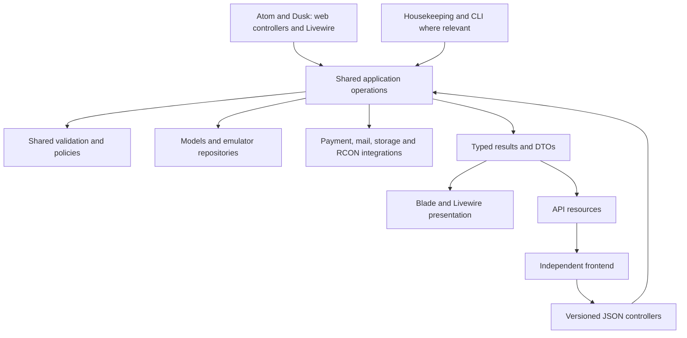

# Atom CMS headless mode and shared application logic

Version: v3 (2026-09-08). Implementation contract and acceptance criteria; see [Implementation status](#implementation-status) and the historical [Changes in v2](#changes-in-v2).

Status: implementation in the `feature/headless-mode` draft, stacked on the separate housekeeping login 2FA fix. The [operator guide](headless-mode.md) and [OpenAPI contract](api/openapi.json) describe the implemented interface; the acceptance checklist below is not a claim that every live integration has been exercised.

Source baseline: `dev` at `8d1a8341`. This plan is based on source inspection, including the existing routes, installer, authentication, Livewire interactions, emulator drivers, housekeeping, payments, and tests. Runtime behavior must be verified during implementation. The September 2026 audit pull requests (#214 to #234) touched the authentication, throttling, theme, and mail seams this plan relies on; their original prerequisite inventory is retained below. The implementation was rebased onto the integrated fixes and the separate housekeeping MFA draft.

## Implementation status

The draft implements full/headless route registration, shared operations and explicit public projections, versioned adapters across the feature map, JSON access restrictions, cookie/CORS authentication, Atom 2FA enrollment JSON, independent housekeeping assets, CLI setup/mode conversion, and the separate Nuxt Dusk frontend requested during implementation. The Nuxt frontend lives in [atom-nuxt](https://github.com/DennisObject/atom-nuxt), with its own package, copied public artwork, generated API types, and no PHP/database dependency.

The checked-in OpenAPI schema is the external wire contract; native PHP DTOs remain internal application boundaries. `npm run api:generate` generates the published `docs/api/schema.d.ts` definitions. Frontend API upgrades copy that file into `atom-nuxt/app/types/api-schema.d.ts`. `npm run api:check` compiles schemas, checks the generated definitions, and checks Laravel route coverage. Representative Pest requests validate real response bodies with AJV rather than repeating field assertions. Backend CI builds both PHP themes and independent housekeeping. The Nuxt frontend has its own build workflow in `atom-nuxt`.

Corrections carried into implementation: Atom's enable/confirm/disable actions and QR/recovery reads need explicit JSON behavior; route removal can cause missing-name exceptions or later 404s for literal destinations; parallel aliases can share named throttle buckets; and housekeeping must use one authoritative Fortify credential set, without forbidding a compatible custom Filament integration. Housekeeping's independent build directory is `build-housekeeping` (a sibling of `build`).

The checklist remains a release gate. Runtime/browser verification and configured external integrations must be reported separately from source inspection, contract tests, and asset builds. No checkbox below is automatically satisfied by this status note.

## Changes in v2

- Authentication: Fortify's existing endpoints already return JSON for login, two-factor challenge, registration, and logout when a request wants JSON. v1 proposed a parallel `/api/v1/auth/*` adapter layer; v2 makes Fortify's routes plus Atom's custom reset routes the documented auth contract and drops the parallel layer.
- Route split: eight middleware and the Fortify provider redirect to public route names (`welcome`, `login`, `me.show`, `banned.show`, `maintenance.show`, `settings.two-factor`, `installation.*`). Unregistering public routes without replacing those destinations can throw `RouteNotFoundException` for named lookups or lead to a subsequent 404 for literal paths. v2 makes this an explicit prerequisite of the route split.
- Hidden dependencies: `hasPermission()` resolves the actor from `auth()->user()` inside `PermissionsService`; added alongside the registration IP and session-read cases.
- Application bootstrap: the project still uses `app/Http/Kernel.php`, `RouteServiceProvider`, and `app/Exceptions/Handler.php`. v2 names where mode-dependent route registration and JSON error selection actually live, and keeps a `bootstrap/app.php` migration out of scope.
- CORS: named the concrete paths that need credentialed CORS and the trade-off for the four legacy public endpoints, which rely on wildcard origins today.
- Housekeeping: Filament's `viteTheme()` accepts a build directory, which is the mechanism for a separate admin manifest. Housekeeping must share Fortify's authoritative credentials; Filament's default storage uses a separate secret, while a custom compatible integration can reuse the existing credentials. The housekeeping login page authenticates through Filament's own attempt and never runs Fortify's two-factor challenge; v2 records that as a gap to close.
- Configuration: listed the environment keys the mode command must write and the existing `atom:setup` and `build:theme` commands the installer work extends.
- Delivery: added prerequisite work on the open audit pull requests and the Filament login check to verification.

## 1. Intended outcome

An advanced developer can clone Atom, install it in headless mode, and build an independent frontend in Vue, React, Angular, Svelte, or another HTTP client. Atom owns authentication, application rules, content, permissions, persistence, payments, and emulator integration. The frontend owns navigation, page composition, rendering, and interaction design.

The existing Atom and Dusk themes remain supported. Both modes call the same application logic and use the same database. Headless mode is a reversible deployment choice within the existing application.

The primary maintenance requirement is that a business rule is implemented and corrected in one place. DTOs make the data crossing that interface explicit; small web and API adapters translate that data into HTML or JSON.

### Success criteria

- A fresh headless installation can be completed without loading a public theme or visiting its pages.
- An existing installation can enable headless mode and return to full mode without reinstalling or modifying hotel data.
- The complete public website feature set has a documented API equivalent, subject to the configured emulator's capabilities and existing access rules.
- The built-in themes, Livewire interactions, and API use the same application operations for each migrated feature.
- Housekeeping, its authentication, its assets, queued mail, webhooks, and scheduled jobs work in either mode.
- A separate example frontend can register, log in, handle two-factor authentication, read content, update an account, and launch a supported game client.
- API contracts are versioned and checked so a backend refactor does not silently break independent frontends.

### Scope limits

This project adds the headless operating mode and the API needed to replace the public website. Housekeeping keeps its existing Filament UI. A public administration API, mobile authentication, OAuth applications, GraphQL, an SDK for every framework, a theme marketplace, and a separate backend package are outside this implementation.

An early developer preview may cover fewer features, but full headless support is complete only when the coverage and acceptance criteria in this document pass.

## 2. Existing foundations and work required

This table records the original source baseline and migration requirements; consult the implementation status, operator guide, and OpenAPI for the current draft interface.

| Area | Current implementation | Required change |
| --- | --- | --- |
| HTTP routes | [API routes](../routes/api.php) contain four public user/online endpoints and a PayPal webhook. Most features live in [web routes](../routes/web.php). Both files are registered by the legacy [RouteServiceProvider](../app/Providers/RouteServiceProvider.php). | Add a versioned public-website API; preserve existing endpoints and response shapes. Split public pages from routes needed by both modes. Mode-dependent registration lives in the route provider. |
| Application bootstrap | The project runs Laravel 13 with the pre-11 structure: [Kernel](../app/Http/Kernel.php) middleware groups, a route provider, and an [exception handler class](../app/Exceptions/Handler.php) that already has one route-scoped JSON renderable for the home widget endpoint. | Work inside that structure. Migrating to `bootstrap/app.php` is a separate refactor and is not a prerequisite for headless mode. |
| Shared writes | [Account updates](../app/Actions/User/UpdateAccountSettings.php), [shop purchases](../app/Actions/Shop/PurchaseShopPackage.php), and other actions already contain reusable logic. | Reuse and adapt these operations; replace loose payloads or presentation-specific results where a typed contract helps. |
| Livewire | [Article comments](../app/Livewire/ArticleComments.php) and [reactions](../app/Livewire/ArticleReactions.php) already share services with controllers. | Keep this pattern; consolidate repeated validation, visibility rules, and read queries as features migrate. |
| DTOs | [SessionLogData](../app/Data/SessionLogData.php) and [emulator data objects](../app/Emulator/Data/RoomSummary.php) already use native readonly classes. | Extend the existing convention with small input and result types. |
| Authentication | Fortify is installed and [Sanctum's stateful middleware](../app/Http/Kernel.php) is already in the API group. Fortify's login, two-factor challenge, registration, and logout responses already return JSON when the request wants JSON. Password reset is Atom's own controller because Fortify's reset feature is disabled. | Document Fortify's endpoints as the auth contract, give Atom's reset and 2FA management flows plus restriction middleware JSON outcomes, and configure cookies, CSRF, CORS, and access restrictions for a separate frontend. |
| Hidden request dependencies | [Registration](../app/Actions/Fortify/CreateNewUser.php) obtains the IP through `request()`; [session reads](../app/Services/User/SessionService.php) take an HTTP request and format relative times; [`hasPermission()`](../app/Services/PermissionsService.php) resolves the actor from `auth()->user()`. | Pass required context explicitly, including the actor for permission checks; move presentation formatting to adapters. |
| Theme dependencies | Theme and installation middleware are global. [Home widget reads](../app/Services/Home/HomeService.php) render Blade into JSON responses. Ban, maintenance, installation, staff 2FA, VPN, emulator-feature, and guest middleware redirect to public route names. | Scope theme middleware; return widget data independently from its HTML renderer; route every middleware redirect through the frontend URL module. |
| Installation | [The installer](../app/Console/Commands/AtomInstallCommand.php) always sets up a theme and ends by directing the operator to `/installation`. | Add a complete CLI configuration path using shared installation operations. |
| Housekeeping | [Filament](../app/Providers/Filament/AdminFilamentPanelProvider.php) has its own [login page](../app/Filament/Pages/Login.php) that authenticates through Filament's attempt and never runs Fortify's two-factor challenge; forced staff 2FA redirects to public settings. Theme builds also compile housekeeping CSS into the shared manifest. | Provide independent admin enrollment and a two-factor challenge on housekeeping login, plus an independent admin asset build. |
| External returns | Password-reset mail and PayPal completion depend on public website routes. | Resolve frontend destinations centrally while retaining backend ownership of payment processing. |
| Emulator support | [Driver contracts](../app/Emulator/Contracts/EmulatorDriver.php), repositories, and [feature declarations](../app/Emulator/Data/Feature.php) already normalize supported emulator behavior. | Use these contracts in shared operations and expose a safe capability description to frontends. |

This is an incremental extension of the current structure. Existing services and actions should be improved where they are reused; a repository-wide rename or rewrite is unnecessary.

## 3. Architecture and ownership



The application operation is the seam. Its interface describes the actor, input, result, authorization, failure conditions, and side effects. Its implementation owns the complete operation. Controllers remain small adapters to that interface.

### Shared application responsibilities

- Reads: filtering, visibility, eager loading, ordering, pagination, aggregation, and projecting results into the data callers need.
- Writes: authorization, business invariants, transaction ownership, concurrency checks, persistence, cache invalidation, and existing side-effect delivery guarantees.
- Common decisions: registration eligibility, account restrictions, stock and balance rules, recipient eligibility, comment limits, support ownership, and emulator capability checks.
- Structured outcomes: data and stable failure reasons that each presentation can render appropriately.

Use the current `app/Actions` and `app/Services` organization. Add focused read operations to an existing feature service, or introduce `app/Queries/<Feature>` when a query needs a distinct interface. Do not create both an action and a forwarding service for the same operation.

Eloquent and Laravel remain implementation tools. Reuse emulator repository interfaces because their implementations actually vary. Additional interfaces, command buses, generic repositories, or a dependency-free domain framework require a demonstrated need.

### Adapter responsibilities

| Adapter | Owns |
| --- | --- |
| Web controller | HTTP input, invoking the shared operation, selecting a view or redirect, flash messages, and view data presentation. |
| API controller/resource | HTTP input, invoking the same operation, JSON field allowlists, status codes, pagination links, and version-specific response formatting. |
| Livewire | Form state, events, incremental UI updates, and calls into the same operations. |
| Filament | Administrative UI and its permissions; shared operations when performing the same business action as another caller. |
| CLI | Operator input, configuration persistence, progress output, and calls into shared installation/configuration operations. |

The built-in website calls PHP operations directly. It does not make HTTP requests to its own API, serialize DTOs to JSON and back, or depend on the example JavaScript client.

Separate HTML and JSON controllers are acceptable small duplication. Business rules, persistence, queries, and authorization must not be copied between them. Avoid distributing `if (headless)` or `expectsJson()` branches through application logic.

### Proposed placement

```text
app/
  Actions/<Feature>/                  # Existing write operations, adapted in place
  Services/<Feature>/                 # Existing cohesive feature modules
  Queries/<Feature>/                  # Only read operations needing their own module
  Data/<Feature>/                     # Native immutable input/result objects
  Validation/<Feature>/               # Rules shared by HTTP, Livewire or other callers
  Policies/                           # Existing actor/resource authorization
  Http/Controllers/Api/V1/            # Thin new JSON adapters
  Http/Resources/Api/V1/              # Explicit public wire representations
  Http/Requests/                      # Reused requests or thin transport-specific mapping
  Support/FrontendUrls.php            # Semantic frontend destinations
  Providers/RouteServiceProvider.php  # Existing; registers route files per mode
config/atom.php                       # Operating mode and frontend configuration
routes/api/v1.php                     # Versioned API operations
routes/web.php                        # Public website routes, full mode only
routes/shared.php                     # Shared browser callbacks/auth support as needed
resources/css/filament/housekeeping/  # Existing theme CSS plus its own Vite config
docs/api/openapi.yaml                 # Public HTTP contract
examples/headless/                    # Independent minimal frontend example
```

`config/hotel.php` and `config/habbo.php` already exist; `habbo.site.site_url` is an alias of `APP_URL` and must not be reused as the frontend URL.

These are proposed locations. Existing classes stay in place unless moving one materially improves the feature being implemented.

## 4. DTO design

Use native `final readonly` PHP classes, matching the existing code. Start without a DTO package, reflection mapper, or universal base DTO.

### Input objects

- Describe a use case, such as `UpdateAccountSettingsData`, `PurchasePackageData`, or `SaveHomeData`. Avoid exposing arbitrary model attributes.
- Use typed named properties. Keep simple operations with one clear scalar argument simple; a DTO is useful when it clarifies a compound contract.
- HTTP adapters extract and normalize accepted fields. Shared validation defines their constraints; the application operation enforces business invariants and authorization.
- Never take the acting user's identity, rank, balance, permissions, or ownership from an input DTO. Resolve the actor from authenticated server context.
- Preserve omitted-versus-cleared values where the operation supports partial updates. Define this per operation; do not silently turn omitted fields into null or empty strings. Keep existing PUT semantics unless a new PATCH contract is deliberately introduced.
- Supply only context an operation needs: actor, verified client IP, current session identifier, or locale. Do not pass a whole Request, session store, or a generic context bag through every operation.
- Passwords, captcha responses, recovery codes, and SSO values are sensitive inputs or results. Exclude them from generic logging and debug serialization; use PHP's sensitive-parameter support where applicable.

### Read and result objects

- Provide application data, not redirect destinations, translated flash messages, HTML fragments, or JSON responses.
- Keep public and private representations distinct: `PublicUserData` must not grow email, IP, balance, session, or moderation fields needed by `CurrentUserData` or housekeeping.
- Use focused list/detail projections instead of one enormous user/article object with many optional properties.
- Use immutable dates and explicit numeric values. Relative times and currency labels belong in presentation. Reuse the current money handling; represent website money externally in minor units with its currency code.
- A result DTO must not perform queries, lazy-load relations, read the current request, or cause side effects when a property is accessed.
- Laravel collections and paginators can contain DTOs. Retain their useful behavior instead of building a second pagination framework.
- A mutation may return `void`, a scalar, or a typed result depending on the caller's needs. Do not manufacture result wrappers for every method.

### Example: shared purchase operation

This illustrates the intended shape; it is not implementation code or a final schema.

```php
final readonly class PurchasePackageData
{
    public function __construct(
        public int $packageId,
        public ?string $recipientUsername,
    ) {}
}

final readonly class PurchasePackageResult
{
    public function __construct(
        public int $purchaseId,
        public string $packageName,
        public string $recipientUsername,
        public int $chargedMinor,
        public string $currency,
    ) {}
}

// Both HTTP adapters call the same existing action after it is adapted.
$result = $purchaseShopPackage->execute($actor, $input);

// Web adapter: select its redirect and translate its success message.
// API adapter: map the same result to an explicit purchase resource (201).
```

The existing purchase action continues to own recipient resolution, eligibility, offline requirements, stock checks, locking, payment from website balance, delivery, and purchase logging. It returns the receipt produced by that operation instead of a translated success sentence. It must not re-run the purchase or query an ambiguous "latest purchase" to construct the result.

### DTOs and JSON resources

DTOs are the shared PHP application contract. API resources are the versioned HTTP contract. This small mapping is intentional: internal names can evolve without changing `/api/v1`, and private fields cannot become public through automatic model serialization.

Resources map already prepared data and do not contain business logic or query the database. Use explicit field allowlists; neither `Model::toArray()` nor serializing every DTO property defines a public response. Laravel's [API resources](https://laravel.com/docs/13.x/eloquent-resources) provide the existing framework mechanism for response transformation and collection/pagination metadata.

Do not duplicate PHP DTO definitions by hand in several JavaScript clients. Generate TypeScript types from the public OpenAPI contract. PHP types alone do not describe routes, cookies, permissions, errors, or compatibility requirements.

## 5. Validation, authorization, and errors

Consolidate a rule only when it has multiple callers or belongs to an operation invariant. For example, article comment length and wordfilter rules currently appear in both a FormRequest and Livewire; those callers should use one rule definition.

FormRequests retain transport concerns such as payload shape and uploaded-file handling. Shared validators can use Laravel's validator; a new validation framework is unnecessary. Livewire may validate early for UI feedback, but the shared write interface must still enforce the substantive constraints that protect the operation. Do not perform a paid captcha/provider verification twice just because a second layer exists.

Resource authorization belongs to the shared operation through the existing policies or permission helpers that accept an explicit actor. Route authentication and broad request restrictions remain middleware responsibilities. Hiding a button or omitting a frontend capability never replaces backend authorization. Security-sensitive account changes must retain current-password verification regardless of which adapter invokes the operation.

Convert presentation-dependent exceptions to stable reasons as a feature migrates. Preserve existing web field errors and translated messages through a presenter. Reuse Laravel's validation and authorization exception handling where suitable; create typed business failures only where callers need a distinct outcome. A translated message must never be the value a frontend parses to decide what happened.

Proposed JSON failure shape:

```json
{
  "code": "validation_failed",
  "message": "Some fields need attention.",
  "errors": {
    "mail": ["This email address is already in use."]
  }
}
```

| HTTP status | Meaning and example code |
| --- | --- |
| 400 | Malformed request, `invalid_request`. |
| 401 | Authentication required or expired, `unauthenticated`. |
| 403 | Authenticated access denied, `forbidden`, `account_banned`, or `two_factor_required`. |
| 404 | Missing or deliberately undisclosed resource, `not_found`; unsupported emulator feature, `feature_unavailable`. |
| 409 | Documented operation conflict, such as changed stock or a conflicting idempotency request. |
| 419 | Expired/missing CSRF state, `csrf_token_mismatch`; retain Laravel's status and document recovery. |
| 422 | Input validation failure or a field-specific business rejection. |
| 429 | Rate limit exceeded, with retry metadata. |
| 503 | Installation incomplete, maintenance, or a required integration temporarily unavailable; distinguish each with a stable code. |

Use success statuses consistently: 200 for data/updates, 201 for created resources, and 204 when no body is needed. Provider approval redirects and backend browser callbacks have their own documented browser behavior.

The `/api/v1/*` exception path must produce JSON even for missing routes, early middleware failures, or absent Accept headers. Scope this behavior to the versioned API so it does not change existing Blade, Filament, or legacy JSON contracts. In the current handler class this is an override of `shouldReturnJson()` keyed on the request path, plus a renderable that maps typed business failures to the shape above; the existing home-widget renderable shows the pattern.

## 6. Operating modes and route separation

Proposed configuration:

```dotenv
ATOM_MODE=full
ATOM_FRONTEND_URL=
```

`full` is the default. `headless` requires an explicit frontend origin. Read these through Laravel configuration so cached configuration and route registration agree. Environment settings own the deployment mode; avoid also storing a competing mode flag in `website_settings`.

Headless mode also sets `fortify.views` to false so Fortify's GET view routes disappear with the theme, and the mode command writes the deployment keys the browser session needs: `SANCTUM_STATEFUL_DOMAINS`, `SESSION_DOMAIN`, `SESSION_SECURE_COOKIE`, and a new environment-backed CORS origin list. None of these exist in `.env.example` today.

| Surface | Full mode | Headless mode |
| --- | --- | --- |
| Public Atom/Dusk routes | Enabled | Not registered; requests return 404 |
| `/api/v1/*` | Enabled | Enabled, same operations and policies |
| Existing `/api/*` endpoints | Preserved | Preserved |
| `/housekeeping` and its assets | Enabled | Enabled |
| Livewire update and asset routes | Enabled | Enabled; Filament depends on them |
| Fortify auth endpoints (`/login`, `/logout`, `/register`, `/two-factor-challenge`, two-factor management) | Enabled with views | Enabled; view routes disabled |
| Atom password reset endpoints | Enabled with pages | POST endpoints enabled; pages replaced by the frontend |
| Session/CSRF endpoints | Enabled | Enabled |
| Payment callbacks/webhook | Enabled | Enabled |
| Public browser installation wizard | Available for standard setup | CLI setup; no dependency on its pages |
| Queue workers, mail, storage, scheduled jobs | Normal operation | Normal operation |

Keep an explicit route split. Do not disable the whole `web` middleware group: browser authentication, housekeeping, and payment callbacks still need sessions and appropriate CSRF handling.

Scope theme selection and theme-only view preparation to the public website. Headless API requests and queued mail must boot without a selected public theme. Installation middleware must return a JSON `installation_incomplete` response on the API instead of redirecting to the wizard. A narrowly scoped status response may report that setup is incomplete without exposing setup keys or settings.

Move shared browser endpoints out of the public-route group before disabling it. Keep route names stable for existing full-mode callers. Mode changes require configuration and route cache rebuilding and worker reloads; the command must account for this explicitly.

Replace route-name redirects before the split. `BannedMiddleware`, `MaintenanceMiddleware`, `InstallationMiddleware`, `ForceStaffTwoFactorMiddleware`, `VPNCheckerMiddleware`, `EnsureEmulatorFeature`, `RedirectIfAuthenticated`, `Authenticate`, and the Fortify provider's closed-registration view all call `to_route()` or `route()` with public names such as `welcome`, `login`, `me.show`, `banned.show`, `maintenance.show`, and `settings.two-factor`, or use `RouteServiceProvider::HOME`. Once those routes are unregistered, named-route lookup can throw `RouteNotFoundException`, while literal destinations can lead to a later 404. Each must resolve its destination through the frontend URL module for browser requests and return a stable JSON outcome for API requests.

`InstallationMiddleware` also creates and advances the wizard record from any request and locks the wizard to the first requester's IP. API and housekeeping requests during an incomplete installation must return the JSON status without creating or stepping that record.

## 7. Authentication and deployment

### Supported default

Use the existing Fortify login/2FA implementation and Sanctum session authentication. A frontend can live in a separate repository and deployment while sharing the same site with Atom, for example `hotel.example.com` and `api.example.com`, or using a same-origin reverse proxy. This follows [Sanctum's documented SPA authentication model](https://laravel.com/docs/13.x/sanctum#spa-authentication).

For sibling hosts, configure explicit allowed origins, credentialed CORS, stateful hosts including development ports, and an appropriate cookie domain. For same-origin proxy deployments, prefer host-only session cookies. Require HTTPS for production and keep local HTTP examples explicitly local. Do not derive a registrable cookie domain by simply taking the last two hostname labels; show or accept the operator's intended value.

Unrelated frontend/backend sites are outside the default cookie deployment recipe. Document a same-origin backend proxy for that arrangement. Mobile/personal access token authentication can be designed separately if requested; headless mode must not automatically issue long-lived browser tokens or instruct developers to store credentials in localStorage.

### Auth routes and flow

Fortify's routes are the authentication contract. Its login, two-factor challenge, registration, and logout responses already return JSON when the request sends `Accept: application/json`: login answers `{ "two_factor": true|false }`, the challenge and logout answer 204, registration answers 201, and a failed challenge raises a 422 validation error. This is the same model [Sanctum's SPA documentation](https://laravel.com/docs/13.x/sanctum#spa-authentication) describes. A parallel `/api/v1/auth/*` layer adds another adapter to maintain without a needed new capability, so this design reuses Fortify. Aliases can share named throttle buckets; separate routes do not inherently split them.

What still needs work is everything around Fortify:

- Atom's password reset flow is custom because Fortify's reset feature is disabled. Its POST routes need JSON outcomes, and the reset email link must point at the frontend in headless mode.
- The Fortify route group runs `maintenance` and `check.ban`, which redirect. Those middleware need JSON outcomes for JSON requests.
- Fortify registers its own two-factor management routes under `/user/two-factor-authentication`, while Atom registers a throttled enable/confirm/disable flow under `/user/settings/two-factor-authentication`. Use Atom's flow as the recommended enrollment interface, including JSON enable/confirm/disable and a protected QR/recovery read. Record Fortify's remaining native management endpoints in OpenAPI for compatibility; they operate on the same credentials.
- Session logs, password change, and account settings are Atom routes and get v1 adapters like any other feature.

Retain the existing full-mode routes and names. Do not move Fortify's route prefix, and do not implement an independent password-check/login flow for the API.

1. Fetch `/sanctum/csrf-cookie` with credentials.
2. Submit `POST /login` with credentials, the XSRF header, and a JSON Accept header.
3. If the response reports `two_factor: true`, complete `POST /two-factor-challenge` using the same pending session. Do not expose authenticated account data before that succeeds.
4. Fetch `/api/v1/me`; protect authenticated endpoints with `auth:sanctum` and the relevant existing restrictions.
5. `POST /logout` invalidates the session and rotates CSRF state. Document recovery from 401 and 419.

[Fortify supports a frontend-independent authentication backend](https://laravel.com/docs/13.x/fortify#disabling-views); headless mode disables its view routes, but that alone does not adapt Atom's custom routes, reset controller, or middleware.

### Behavior that must survive the migration

- Login throttles, session regeneration, recovery-code behavior, password hashing, and existing session invalidation.
- Registration closure, beta codes, referral attribution, account/IP limits, captcha validation, identifier uniqueness, and the registration mutex. Extract explicit IP input from `CreateNewUser` while keeping the Fortify adapter compatible with its required interface.
- Current-password checks for sensitive account changes; 2FA enable/confirm/disable/recovery flows and their throttles.
- Password reset's generic response for unknown emails, hashed token storage, expiration, and token consumption in Atom's `website_password_resets` table. Share the current implementation after extraction rather than replacing it with another token store.
- Ban checks, maintenance access for eligible staff, and required staff 2FA. Give the API machine-readable outcomes from the same underlying decisions.
- Existing exceptions to restrictions: logout and required 2FA enrollment must remain reachable; authenticated banned users must retain the support access currently allowed by web routes. Maintenance must permit the login/2FA steps needed for eligible staff to authenticate.

Refactor path-based exceptions such as `logout` into route/operation classifications covering both adapters. Bind the authenticated actor before evaluating actor-dependent restrictions. Share throttling buckets for equivalent write/auth operations where separate web/API routes would otherwise multiply the permitted attempts.

The current [CORS configuration](../config/cors.php) only covers `api/*`, uses wildcard origins, and disables credentials. Credentialed CORS must cover `api/v1/*`, `sanctum/csrf-cookie`, `login`, `logout`, `register`, `two-factor-challenge`, `forgot-password`, `reset-password/*`, and Atom's two-factor management routes, with an explicit origin list because browsers reject a wildcard origin with credentials.

That creates one compatibility decision. The four legacy public endpoints are served cross-origin to any site today. Laravel's CORS middleware uses one origin list, so listing explicit origins would stop third-party sites from calling them. Keep the legacy endpoints on a separate wildcard, non-credentialed CORS path so their behavior does not change, and apply the credentialed configuration only to the paths above. A unit test that only uses `actingAs` cannot prove browser cookie authentication works.

## 8. API contract and complete feature coverage

Use REST/JSON under `/api/v1`. A separate framework-specific backend is unnecessary. Define request/response schemas, auth requirements, pagination, rate limits, failures, and examples in `docs/api/openapi.yaml` as each feature is implemented.

### Conventions

- Explicit snake_case JSON fields, consistent identifiers, booleans as booleans, nullable fields documented, and UTC ISO-8601 timestamps.
- Single resources use `{ "data": ... }`; collections add documented `links` and `meta`. Use Laravel pagination conventions. Start with a default page size of 20 and a maximum of 100, allowing documented tighter limits for expensive endpoints.
- Website money uses `{ "amount_minor": 299, "currency": "USD" }`; emulator currencies use their supported identifiers and integer amounts. Reuse `StorefrontMoney` for conversions.
- Filtering and sorting accept named supported fields only; never expose arbitrary database query parameters or relationship includes.
- Return absolute, configured public media URLs so separate origins work. Keep private downloads authenticated. Do not expose filesystem paths.
- Article bodies may be explicit sanitized rich HTML content. UI fragments such as rendered home widgets do not belong in the data API. Plain text and rich content must have distinct documented treatment.
- Resolve an API locale from supported `Accept-Language` values with a configured fallback. Keep stable error codes independent of translations. Preserve the existing web locale/session behavior through its adapter.
- Public bootstrap data is an allowlist: hotel identity, branding/media URLs, supported locales, registration state, public captcha site keys, and implemented capabilities. Never return the whole settings table or integration secrets.
- Separate hotel/emulator capabilities from per-user authorization. A feature is advertised only when its API implementation exists and the configured driver/settings support it. Continue checking authorization on every operation.

### Coverage map

Paths below are proposed endpoint families, not an exhaustive OpenAPI definition. Existing access rules remain the baseline; "public" describes the replaceable website surface, not blanket guest access.

| Feature | Proposed API operations | Shared behavior and release requirement |
| --- | --- | --- |
| Bootstrap and status | `GET /bootstrap`, `GET /status` | Safe settings, assets, locales, feature availability, maintenance/setup state; reachable enough to render access notices. |
| Authentication | Fortify's `/login`, `/register`, `/logout`, `/two-factor-challenge`; Atom's reset POST routes and two-factor management routes, documented in the contract | Full login/registration/reset/2FA behavior described above; JSON outcomes from the restriction middleware. |
| Current account | `GET /me`; read/update `/me/settings`; password update; session logs | Private projection, current-password checks, rename entitlement, emulator constraints, session privacy, supported balances. |
| Referral flow | Referral code accepted at registration; `POST /me/referral-rewards/claim` | Attribution, eligibility, single-claim protections, and rewards through the existing action. |
| User directory and online counts | `GET /users/{username}`, `/users/search`, `/users/online`, `/users/online-count` | Safe public projections, search limits, privacy; existing unversioned endpoints preserved. |
| Articles and interactions | List/detail articles; list/create/delete comments; documented reaction operations | Publication/visibility rules, wordfilter, locks, limits, author permissions, and the same results used by web/Livewire. |
| Community | Staff, teams, leaderboards, photos | Existing guest/member rules, hidden staff visibility, normalized driver data, camera capability gate. |
| Applications | List/detail open staff/team positions; submit applications | Availability, duplicate-application checks, permissions, and existing submission action. |
| Shop | Categories/packages; `POST /shop/purchases`; voucher redemption; own purchase receipts | Pricing, stock, gifts, limits, atomic delivery, balances, and RCON/offline handling. |
| PayPal top-ups | Create order, read own order status; backend return/cancel routes and existing webhook | Ownership, amount/currency validation, capture/reconciliation, and exactly-once crediting. |
| Help center | Rules, own/authorized tickets, create/update/delete, status changes, replies | Existing support policies and banned-user exceptions; staff listing only with its existing authority. |
| Homes | Layout/items, widget data, save, inventory, item shop/purchase, messages, ratings | Scoped ownership, visibility, sanitization, inventory rules, balance/quantity checks; no Blade dependency in v1 data. |
| Badge tools | Purchase/upload operation and required safe editor configuration | Existing image/file validation, costs, permissions, and badge delivery behavior. The drawing UI belongs to the frontend. |
| Rare values | Categories, search/list/detail, authorized holdings | Driver capability gate, current visibility and search rules, shared aggregation. |
| Game entry | `POST /client/launch` with a supported client identifier | Authenticated launch result, server-derived IP, SSO issuance, vote/VPN/ban/maintenance/2FA restrictions. |
| Logo tool | Authorized metadata and logo upload/update | Existing permission and storage rules. The logo editing UI belongs to the frontend. |

No public housekeeping CRUD API is introduced. Administrative operations stay under Filament. Do not expose raw RCON commands, arbitrary user columns, server configuration secrets, or emulator administration through the new website API.

### Compatibility and retries

The four existing public API endpoints and legacy home JSON endpoints keep their routes and wire shapes. Their adapters may call shared operations, but a new v1 resource must not silently replace their responses.

Within v1, preserve fields, meanings, status codes, and documented behavior. Additive optional fields are allowed; clients must tolerate unknown fields. Treat new enum variants carefully and define unknown-value handling. Breaking changes require a new API version and a migration guide. DTO refactoring alone never justifies a public contract break.

Document which mutations are safe to retry. Prefer explicit set/remove semantics for new reaction operations over an automatically retried toggle; retain the old toggle adapter where needed. Do not blindly retry purchases, referral claims, or other writes in the example client.

For new purchase/order creation APIs, require a client idempotency key scoped to actor and operation, bound to a normalized payload. Persist reservation/result state with the operation; reuse returns the original result and reuse with a different payload returns 409. Preserve existing payment deduplication and transaction locks. Implement recovery for an interrupted external order request using the provider's existing reference/status mechanisms; a cache-only key cannot prove an external effect happened exactly once.

Keep any new idempotency records in a CMS-owned table such as `website_api_idempotency_keys`, with a unique actor/operation/key constraint and an index for expiry. Store references and the minimal safe result, not passwords, tokens, or complete request bodies. Publish the retention/retry window in the contract; cleanup must retain unresolved operations until reconciled. Schema changes are additive, must work with both emulator databases, and must not modify emulator-owned tables. Mode reversal retains these records so switching presentations cannot erase retry protection.

## 9. Frontend URLs, mail, and external integrations

Introduce a small `FrontendUrls` module for semantic destinations such as home, login, banned, maintenance, two-factor settings, password reset, and payment completion. Full mode resolves its existing named routes. Headless mode resolves paths against `ATOM_FRONTEND_URL`; allow server-configured path overrides so frontend routers are not locked to Atom's route layout. The middleware redirects listed in section 6 are its first callers. Draft PR #229, which builds password-reset links from the configured origin instead of the Host header, is the precedent for how this module must construct URLs.

Validate the base URL and path configuration. URLs must be assembled and encoded correctly, without accepting an arbitrary return URL from a browser request. Keep `APP_URL` as Atom's backend URL and use separate public media configuration where assets have another origin.

Move essential mail templates to a theme-independent fallback and pass the resolved URL into the mailable. Full mode may retain presentation overrides. Queue workers must render mail with no HTTP request or selected theme, including jobs queued before a mode change.

PayPal approval URLs are returned as data when an API caller creates an order. PayPal return/cancel URLs continue to point to Atom, where ownership and capture/cancel processing happen. Only after processing does Atom send the browser to the configured frontend result page. The frontend reads authenticated order status; a query parameter claiming success never credits a balance.

Callbacks, webhooks, reconciliation, and logout must remain reachable under their appropriate existing authentication/signature rules. Do not place a browser-session, public-theme, or blanket maintenance gate in front of provider webhooks.

Game launch returns only the configuration the selected client needs plus the acting user's SSO result. Treat the response as private and `no-store`; exclude SSO from public bootstrap, diagnostics, and analytics. Reuse the driver's actual SSO lifecycle and verify it; do not claim short-lived or single-use tickets unless the emulator enforces that property. Expose vote/VPN restrictions as structured outcomes, with a server-generated vote destination when relevant, without bypassing existing game-entry checks.

## 10. Homes and other rendering-dependent features

Homes require an explicit separation of data and rendering. Today both placed-item responses and widget content can include HTML produced by `HomeService` and model helpers.

Create a shared read operation producing layout and widget data: item identifiers, type, coordinates/order, owned asset references, note content, and typed widget payloads such as rooms, badges, friends, and rating totals. Preserve ownership scoping and each widget's visibility rules.

The current themes consume this data through an HTML renderer, retaining the legacy fragment contract for their JavaScript. API v1 resources expose structured data so independent frontends render their own widgets. Both use the same query and permission decisions. Existing sanitized rich note content must be identified as content rather than implicitly trusted arbitrary HTML.

Apply the same approach to session logs, rare-value aggregates, navigation metadata, and permission-dependent page information. Move query/composition logic out of templates or Livewire render methods only as the corresponding feature is migrated; do not rewrite unrelated theme markup.

## 11. Housekeeping and assets

Keep Filament installed and usable. The operating mode does not remove PHP UI dependencies or imply a backend with no assets at all.

- Give housekeeping its own Vite config and proposed `npm run build:housekeeping` script, with the panel calling `viteTheme('resources/css/filament/housekeeping/theme.css', 'build-housekeeping')`. Both existing theme builds currently compile that CSS into the shared `public/build` manifest, so building one theme can overwrite the other's manifest and the admin entry with it; a separate build directory ends that. Extend the existing `build:theme` artisan command rather than adding a second build wrapper.
- In headless setup, build/package housekeeping assets without compiling Atom or Dusk. The deployment guide must explain whether Node runs on the target host or assets arrive prebuilt.
- Give staff a theme-independent 2FA enrollment/confirmation path under housekeeping, using the same shared operations. Retain Fortify as the authoritative secret/recovery-code storage and verification behavior. Filament's default separate storage must not create another credential set; a custom integration that reuses the existing credentials is compatible with this requirement.
- Close the housekeeping login gap. The custom Filament login page authenticates through Filament's own attempt, so a staff account with two-factor enabled reaches the panel without a challenge; only enrollment is enforced. Housekeeping login must run the same second-factor step as the website, in both modes.
- Ensure login, required enrollment, logout, maintenance access, and ban handling do not redirect to disabled public routes.
- Resolve any "visit website" links through the frontend URL module. Keep admin links on Atom's backend origin.
- Verify Filament/Livewire requests, image/media assets, and error screens after removing the public theme build artifacts in an isolated test deployment.

## 12. Installer and mode command

### Proposed operator interface

```bash
# Fresh headless installation; extends the existing installer.
php artisan atom:install --headless --frontend-url=https://hotel.example.com

# Existing installation: configure and activate headless mode.
php artisan atom:mode headless --frontend-url=https://hotel.example.com

# Return to the existing public website and retained theme selection.
php artisan atom:mode full

# Read-only display of effective configuration and readiness.
php artisan atom:mode --status
```

`atom:install` keeps the existing emulator/import options and their protections. `--headless` conflicts with an explicit public `--theme`; report the conflict before making changes. `--skip-build` continues to mean the operator will provide required assets, including housekeeping's; validate/explain missing assets instead of reporting a ready UI.

### Fresh install flow

1. Preflight the selected emulator, database, environment, frontend URL, and required options using the existing installer behavior. Preserve all existing schema/import protections.
2. Set up the database, application key, migrations/seeders, and storage as normal.
3. Collect essential hotel configuration in the terminal, using a shared allowlisted setup schema and validation. Provide a documented settings-file input for noninteractive installation; credentials come from environment or protected input, not echoed command arguments.
4. Define and document a theme-independent first administrator path. For an existing hotel, retain current accounts/ranks and require the operator to explicitly identify any account to promote. For an empty hotel, an explicit CLI administrator-creation step must use the shared identity/password and driver rules; never silently make the first API registrant an administrator or create a default password.
5. Apply the settings and mark installation complete through a shared operation also used by the browser wizard. Match the current handling of multiple installation rows and cache invalidation. Do not merely bypass `InstallationMiddleware` or set an in-memory completion flag.
6. Persist mode/frontend/auth configuration, prepare housekeeping assets, and rebuild affected caches. Report backend API, frontend, and housekeeping addresses plus any outstanding deployment requirements.

Extract setup operations from the current wizard and the legacy `atom:setup --auto` command as needed. Keep one definition of setup fields and persistence behavior across CLI and browser adapters; avoid another seeder or wizard with independent rules.

`atom:mode headless` writes `ATOM_MODE`, `ATOM_FRONTEND_URL`, `SANCTUM_STATEFUL_DOMAINS`, `SESSION_DOMAIN`, `SESSION_SECURE_COOKIE`, and the CORS origin list. Draft PR #225 fixes how the installer quotes literal database credentials in `.env`; the mode command must reuse that writer rather than a second dotenv editor.

### Existing install and reversibility

`atom:mode` changes deployment configuration only. It does not import SQL, run a fresh migration, reseed content, recreate users, change emulator selection, or clear balances. Require a completed installation before activating headless mode.

Validate proposed settings before writing. Support `.env` persistence on conventional installs and an explicit environment-managed workflow for containers; never silently claim a process environment override was changed by editing `.env`. Report the effective configuration and the required deployment restart when values are externally managed.

Preserve the current theme choice. Returning to full mode must ensure its assets exist and report the relevant build command if they do not. Re-running a mode command with the same settings must be harmless.

Write configuration atomically, preserve unrelated environment values, and rebuild only relevant caches. If a local configuration/cache step fails, restore the previous configuration where possible and report the exact incomplete step. Mode switching does not make schema rollback necessary. Reload long-running workers through the deployment process so queued mail uses the intended configuration.

## 13. Runtime overhead and maintenance controls

- Built-in PHP callers use the shared operations directly, avoiding internal HTTP and JSON overhead.
- Project only required fields and load relations once. A result DTO/resource must not conceal an N+1 query.
- Keep existing bounded query behavior, transaction locks, and cache invalidation. Compare representative query counts and response timings before and after migration using the same fixtures.
- Cache public projections only when their inputs are understood. Include locale, feature/driver context, and relevant filters in keys. Do not put private account data, per-user permissions, SSO, or authenticated order status in shared public caches.
- Share underlying cached read data across representations where practical; do not create independent web/API caches with different invalidation rules. Existing brief ban-verdict caching semantics must be consciously preserved or changed in a separate reviewed decision.
- Keep request/actor state out of global singletons. Explicit inputs help avoid behavior changing between HTTP, queued jobs, CLI, or long-running processes.
- Preserve the existing RCON after-commit and payment reconciliation mechanisms. DTO extraction must not move an external effect before commit or send it twice through multiple adapters.
- New cross-mode behavior is added to the shared operation first. Adapter work is limited to input/output and intentional presentation differences.

A useful review question for every migrated feature is: "If the eligibility or persistence rule changes tomorrow, which single module changes?" A duplicate query in two controllers or a policy recreated in JavaScript means the migration is incomplete.

## 14. Documentation and frontend example

Maintain one checked-in OpenAPI contract for public v1 HTTP behavior. Update it alongside routes/resources and verify representative real responses against it. Choose one pinned schema validator/type generator during the first API slice; do not make adopting a documentation SaaS or subscription a prerequisite.

Generate TypeScript response/request types from OpenAPI. Keep one small framework-neutral client helper for credentials, CSRF initialization, error parsing, and pagination. It must not contain pricing, permission, registration, or emulator rules. Schema generation and CI drift checks keep the published types aligned with the API.

Maintain the independent frontend in [atom-nuxt](https://github.com/DennisObject/atom-nuxt), with its own package, configuration, and CI. Do not duplicate its source or assets in the backend repository. The user explicitly requested a Vue recreation of Dusk, so the implementation supplies that independent Nuxt/TypeScript application while preserving the PHP themes. Document how Vue, React, Angular, and Svelte consume the same operations.

The example demonstrates setup/bootstrap, login/register, pending 2FA, logout/session expiration, article browsing, an authenticated account update, and game launch. Later feature slices add concise integration examples for purchases, payments, and widgets. It uses only HTTP/public asset URLs and never imports Atom's backend source, reads its database, or depends on its Blade templates.

Publish local development, sibling-subdomain and same-origin deployment recipes. Include reset-page/payment-return routes, cookie/CORS/CSRF troubleshooting, media hosting, queue workers, scheduler, supported feature discovery, and API compatibility guidance.

## 15. Delivery sequence

### Prerequisite work

The September 2026 audit left draft pull requests open against the same baseline, and several of them build the exact seams this plan needs. Land or rebase on them before phase 1 instead of re-deriving the same changes:

- #221 persists access gates across Livewire requests and #226 shares article interaction throttles between HTTP and Livewire. Those are the shared restriction and throttle buckets of sections 5 and 7.
- #227 normalizes login rate-limit identities and #232 revokes sessions after password changes. The auth contract inherits both.
- #229 builds password-reset links from the configured origin and #230 restores parent-theme inheritance. Frontend URLs and theme-independent mail extend them.
- #231 changes the CAPTCHA rule interface that registration validation will share.
- #233 and #234 are combined branches of the same fixes; use whichever set merges.

Each phase is a set of reviewable changes, not a single large PR. Keep full mode working throughout. Every feature slice converts existing web/Livewire callers and adds its API adapter against the same implementation before it is considered complete.

Authentication, CSRF protection, authorization, and relevant access restrictions are prerequisites for exposing each new write route. Phase 1 includes those protections for its first slice; phase 2 completes the separate-frontend authentication experience and the wider route split. Never expose a temporary unprotected API while waiting for a later phase.

| Phase | Deliverables | Exit criteria |
| --- | --- | --- |
| 1. Prove shared structure | Complete route/behavior inventory; establish DTO, validation, error, resource, and protected-route conventions using articles/comments/reactions as the first slice. Add initial OpenAPI and contract checks. | Built-in controllers and Livewire still work; v1 reads/writes exercise the same operations and policies; no copied comment/reaction rules or duplicated queries remain in migrated paths. |
| 2. Authentication and deployment foundation | Fortify endpoints documented as the auth contract, shared account/reset operations, restrictions and middleware redirects with JSON outcomes, frontend URLs, theme-independent mail, route split, CORS/cookies, separate housekeeping assets, housekeeping 2FA challenge and enrollment. | Real separate-origin browser login/2FA/logout/reset works; housekeeping and queue mail work without public theme assets; full-mode flows remain compatible. |
| 3. Headless setup and useful preview | Installer/mode command, shared installation completion, administrator path, bootstrap/status, account/profile/online data, leaderboards, authenticated game launch, minimal independent example. | Fresh setup and conversion work on isolated Arcturus and Ada installs; mode reversal preserves data; example can complete the main user journey. Label release as a developer preview with an explicit feature list. |
| 4. Commerce and support | Shop, vouchers, referrals, payment creation/status/returns/webhook integration, idempotency, rules/tickets/replies. | Cross-mode behavior and concurrency/retry tests pass; payment reconciliation survives missing browser returns; private resources and banned-user support access behave correctly. |
| 5. Remaining public features | Staff/team applications, teams/photos, homes/widget data and rendering split, badge tools, rare values, logo tool, remaining locale/media details. | Every feature in the coverage map has an equivalent implemented and documented operation or an explicit existing emulator limitation; both themes retain their behavior. |
| 6. Stable release | Complete contracts/generated types, deployment guides, compatibility checks, both themes/admin builds, performance comparison, end-to-end release verification. | All final acceptance criteria pass. Publish headless v1 support with known driver limits and migration guidance. |

There is no fixed percentage claim for code sharing or an unmeasured delivery estimate. Phase 1 demonstrates the pattern; later slices reuse it. Scope is the complete public feature map, and progress is measured by completed behavior rather than endpoint count.

## 16. Verification plan

### Shared behavior and adapter contracts

Use the current Pest tests and fixtures. Test business outcomes through the shared operation with real database behavior where needed. Keep a small set of web/API/Livewire adapter tests proving validation, actor selection, response mapping, and authorization are wired correctly.

Do not duplicate every business-rule test for every frontend. Where parity itself is the risk, run a focused shared scenario through both web and API adapters and assert the same persisted outcome. Retain meaningful current feature tests during extraction; do not replace them with mocks that hide persistence or side effects.

High-value scenarios include registration races and limits, sensitive account changes, comment locks and permissions, stock/balance concurrency, repeated vouchers/referral claims, duplicate or interrupted payment processing, home ownership, and emulator capability gates. Preserve current database isolation: Arcturus and Ada tests use separate databases because table names overlap.

### Required integration checks

- Full/headless mode with each supported emulator: applicable features succeed and unsupported features fail predictably without querying missing tables.
- Guest, member, staff, banned user, maintenance, pending login 2FA, and required staff enrollment outcomes, including support/logout exceptions.
- Real credentialed browser requests between development origins and between production-like sibling hosts: preflight, CSRF, login, 2FA, session rotation, logout, 401/419 recovery, and disallowed origins.
- Missing API route/model and middleware errors are JSON without depending on Accept headers. Existing web and legacy JSON responses stay compatible.
- Fresh install, rerun, invalid/incomplete setup, existing-database protections, explicit administrator setup, conversion, reversal, cached routes/configuration, environment-managed deployment, and missing assets.
- Queue mail with no request/theme, password-reset links, payment approval/return/cancel with and without a valid browser session, webhook delivery, and reconciliation. Expired browser sessions must not cause an unauthorized capture or prevent webhook-based reconciliation.
- Independent example frontend and housekeeping operate when public theme build artifacts are absent. Test Atom and Dusk separately in full mode.
- Housekeeping login with a two-factor-enabled staff account requires the challenge in both modes, and the legacy public endpoints still answer cross-origin requests from unlisted origins.
- Secret/private-field exclusion in public DTO projections and resources; actor-specific data cannot cross users through caching.
- Query-count/timing comparison on articles, profile/leaderboard, home widgets, and shop; no unexplained extra requests, lazy loads, or per-row queries.

### Repository checks

Existing commands, to run during implementation in the configured test environment:

```bash
vendor/bin/pest
vendor/bin/pint --test
vendor/bin/phpstan analyse --memory-limit=1G --no-progress
composer audit --locked
npm audit --omit=dev --audit-level=moderate
npm run build:atom
npm run build:dusk
```

The implementation adds the housekeeping build and OpenAPI/type-generation checks to the existing [CI workflow](../.github/workflows/ci.yml), plus browser coverage or recorded manual checks where actual browser behavior cannot be exercised in CI. A successful PHP test suite or asset build does not prove cross-origin browser authentication, emulator game entry, or live payment behavior.

Execution evidence belongs in the implementation task report and CI. Contract/build success does not prove live game entry, payment delivery, production browser topology, or every release acceptance criterion.

## 17. Final acceptance checklist

- [ ] Full mode remains the default; Atom and Dusk routes, forms, Livewire interactions, and existing API consumers remain compatible.
- [ ] Every migrated feature has one authoritative application implementation for its reads/writes and business rules.
- [ ] DTOs expose typed data without lazy queries or rendering; public/private projections and JSON field allowlists are explicit.
- [ ] Validation, authorization, transactions, caches, and side effects remain consistent across adapters.
- [ ] CLI installation completes without public pages; existing hotel conversion/reversal preserves users, settings, balances, content, and emulator choice.
- [ ] Housekeeping, independent assets, admin 2FA, queued mail, payment callbacks/webhooks, and scheduled jobs function in headless mode.
- [ ] Separate-frontend authentication works in a real browser, including all recovery and restriction paths.
- [ ] The complete feature map is implemented, with driver capabilities accurately advertised and enforced.
- [ ] OpenAPI, examples, generated frontend types, and runtime responses agree; legacy endpoints retain their contracts.
- [ ] An independent frontend can perform the main user journey using only documented HTTP operations and public assets.
- [ ] Existing tests and appropriate new integration/contract checks pass for both emulator suites and both modes.
- [ ] No unnecessary internal HTTP, duplicated business queries, or unexplained performance regressions were introduced.

## 18. Decisions and alternatives

| Decision | Reason |
| --- | --- |
| One application with shared operations and separate response adapters | Keeps behavior and fixes local while allowing HTML and JSON to evolve independently. |
| Native readonly DTOs, introduced where useful | Matches the repository and provides explicit contracts with little dependency or mapping overhead. |
| Keep useful Laravel/Eloquent facilities internally | Avoids a broad framework abstraction project unrelated to enabling a separate frontend. |
| Explicit versioned API resources and OpenAPI | Separates the maintained external contract from internal PHP and database structures. |
| API available in both modes; mode controls public presentation | Enables incremental adoption and parity checks without separate implementations. |
| Sanctum cookie authentication for the supported browser deployment | Reuses existing sessions, Fortify, CSRF protection, and staff authentication behavior. |
| Fortify's routes are the auth API; no parallel `/api/v1/auth` layer | Fortify already answers JSON; reuse avoids an unnecessary second adapter. Shared named limiters remain authoritative. |
| Fortify remains the only two-factor implementation, including for housekeeping | Keep a single authoritative Fortify secret and recovery-code set; compatible custom Filament integration is allowed. |
| Legacy public endpoints keep wildcard CORS on their own path | Third-party sites call them today; the credentialed origin list applies only to session-backed paths. |
| Housekeeping stays server-rendered | Hotel operators retain the existing administration tools and no second admin implementation is required. |
| One minimal independent example and generated types | Gives developers a working reference without maintaining a full theme/client library for every framework. |
| Feature-by-feature migration | Preserves existing behavior and demonstrates each shared interface before expanding the conversion. |

Alternatives considered: making the built-in website call its own HTTP API adds unnecessary runtime and failure overhead; adding JSON branches throughout current controllers mixes presentation concerns; copying controllers into a parallel API tree copies rules and fixes; rewriting every model/service around DTOs delays useful support; extracting a separate core package adds release coordination before there is a second backend consumer. None is needed for the intended outcome.
